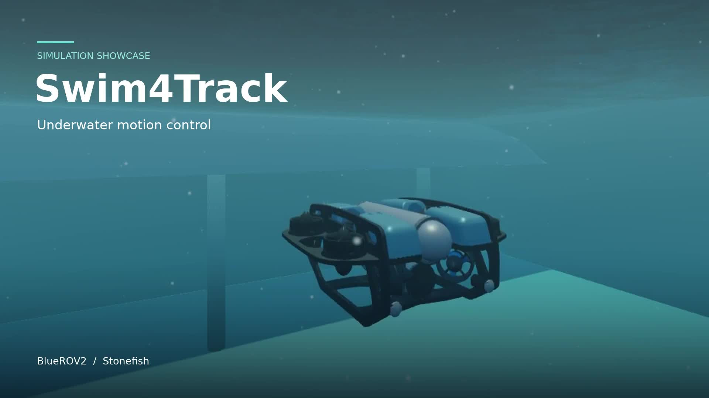

# Swim4Track

**Trajectory-conditioned reinforcement learning for direct thruster control of underwater vehicles.**

Run a six-degree-of-freedom Python plant, train a TQC policy, or deploy the
included frozen checkpoint through ROS 2 in Stonefish. The numerical plant,
23-input/eight-output policy contract, and released weights preserve the
research implementation.

[](docs/assets/Swim4Track_GitHub_demo.mp4)

[Watch the 75-second demo](docs/assets/Swim4Track_GitHub_demo.mp4) ·
[Python plant](docs/python_plant.md) · [Training](docs/training.md) ·
[ROS 2 / Stonefish](docs/stonefish.md) · [Model card](docs/model_card.md)

The video shows actual Stonefish operation at normal playback speed. It is a
project demonstration; controller identity was not independently recovered
from the recording, so it is not presented as a learned-policy benchmark.

## Quick start

From the repository root, using Python 3.10 or later:

```bash
bash scripts/install_python.sh --profile inference
source .venv/bin/activate
python -m swim4track.demo --controller learned --trajectory circle_level --seconds 40 --output runs/learned_circle --plot
```

The installer creates a local virtual environment, installs the package and
checks the bundled model. It requires access to a Python package index.
[Installation and troubleshooting](docs/installation.md) covers missing `venv`,
existing environments, and the earlier editable-install error.

Each run saves `states.csv`, `commands.csv`, `rollout.npz`, `summary.json`, and,
with `--plot`, tracking figures. Choose a fresh output directory for each run.
The summaries describe that rollout; they are not the paper's campaign scores.

For a lightweight plant check without PyTorch, use `--profile core`, then run:

```bash
python -m swim4track.demo --controller pid --trajectory hold_level --seconds 10 --output runs/plant_check --plot
```

## Train a policy

```bash
bash scripts/install_python.sh --profile train
source .venv/bin/activate
python -m swim4track.train --steps 300000 --envs 4 --seed 17 --device cpu --output runs/train_seed17
```

The trainer uses the nominal recipe associated with the released checkpoint:
TQC, a 128–128 actor, two 256–256 quantile critics, and four parallel environments.
It saves configuration, software versions, model checkpoints and training logs.
See [training](docs/training.md) for startup checks, outputs and learning curves.
Training is optional for inference. A new run is not expected to reproduce
bit-identical weights on a different software or hardware stack.

## Simulator prerequisites

Before running Swim4Track in Stonefish, install the simulator,
its ROS 2 wrapper, and the BlueROV2 simulation package:

- **Stonefish simulator:** https://github.com/patrykcieslak/stonefish
- **Stonefish ROS 2 wrapper:** https://github.com/patrykcieslak/stonefish_ros2
- **BlueROV2 simulation package:** https://github.com/bvibhav/stonefish_bluerov2/tree/master

The BlueROV2 repository provides vehicle assets, simulation scenarios,
and setup instructions. Its documented setup specifies `v1.3` of
Stonefish and the ROS 2 wrapper.

Swim4Track's deployment instructions target **ROS 2 Humble** with
direct control of eight thrusters. The upstream BlueROV2 instructions
describe a ROS 2 Jazzy and ArduSub SITL workflow. For Swim4Track's
required scene, launch dependencies, and command interface, follow
the [ROS 2 / Stonefish guide](docs/stonefish.md).


## Infer and test in Stonefish

With ROS 2 Humble and the existing audited Stonefish workspace already working:

```bash
bash scripts/install_ros.sh --workspace /home/sf_ws
source /opt/ros/humble/setup.bash
source /home/sf_ws/install/setup.bash
source .venv-ros/bin/activate
source install/setup.bash
bash scripts/run_stonefish_demo.sh --controller learned --trajectory circle_level
```

Replace `/home/sf_ws` with your workspace if needed. This builds only
`swim4track_ros` in this repository. The wrapper launches a single trial and
records its bag, configuration, status and outcome. Holding, point-to-point
navigation and other reference paths are documented in the
[ROS guide](docs/stonefish.md). It does not rerun the research campaigns.

The ROS node starts disabled and checks odometry freshness and command-topic
ownership before enabling. It targets the eight-thruster BlueROV2 Heavy scene
with the documented NED/FRD coordinate and actuator conventions. Simulator
assets and the local integration launch packages are external prerequisites;
see the guide before using another scene. This is a simulation interface.

## Repository contents

| Location | Purpose |
|---|---|
| `src/swim4track/` | Python dynamics, actuator model, trajectories, observation/reward, training and inference |
| `models/` | Original nominal seed-17 TQC checkpoint, SHA-256 and metadata |
| `ros2/swim4track_ros/` | ROS inference node, launch file and trial monitor |
| `scripts/` | Installation, single-trial execution and optional screen recording |
| `tests/` | Numerical, policy-interface and runtime regression checks |
| `docs/` | Usage, model contract, validation and provenance |


The frozen policy consumes vehicle state and a time-varying reference, not
camera images. The model loader verifies the checkpoint before deserialization
and uses deterministic inference. To verify the bundled file without loading
PyTorch, run `python -m swim4track.policy`; add `--load` to exercise inference.


## Citation and contributions


